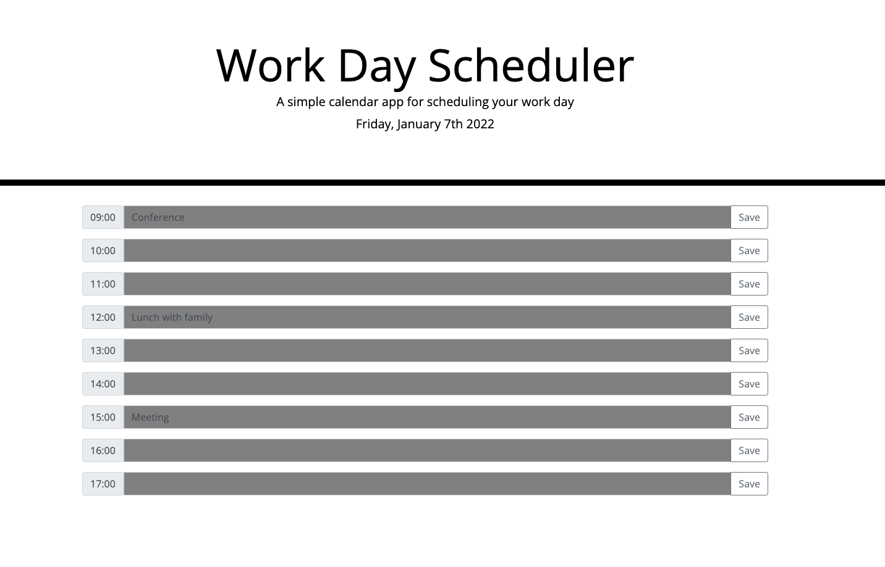
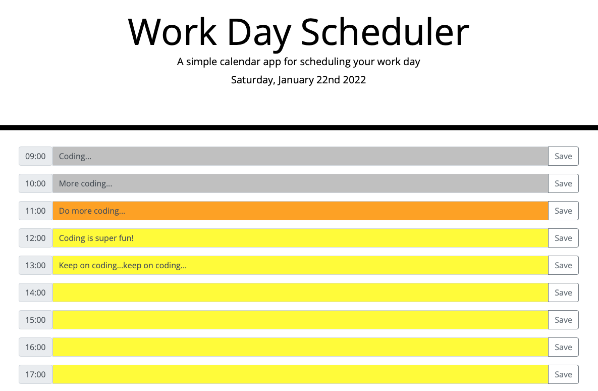

# Work-Day-Scheduler
This Work Day Scheduler is modified using HTML, CSS, and JavaScript. The application features are powered by jQuery incorporate with the Moment.js library for working with date and time.  

## Getting Started
The Work Day Scheduler displays the current day at the top of the calendar. When users scroll down the page, all the time blocks are presented with standard business hours from 9:00am to 17:00pm. Each timeblock is color coded to indicate the past, present, or future event. When users click into a timeblock, they can enter an event by typing inside the event text box. Towards the end of each timeblock, users can save the event in local storage by clicking the save button. When users refresh the page, the saved events remain in display. 

## Built With

* [HTML](https://developer.mozilla.org/en-US/docs/Web/HTML)
* [CSS](https://developer.mozilla.org/en-US/docs/Web/CSS)
* [JavaScript](https://developer.mozilla.org/en-US/docs/Web/JavaScript)
* [Moment.js](https://momentjs.com/docs/)
* [jQuery User Interface](https://jqueryui.com)
* [Bootstrap](https://getbootstrap.com)

## Deployed Link

* [Link to Live Site](https://mandytsang007.github.io/Work-Day-Scheduler/)
* [Link to Github](https://github.com/MANDYTSANG007/Work-Day-Scheduler)

## Design Layout

## Authors

**Mandy Tsang** 

- [Portfolio](https://mandytsang007.github.io/new-portfolio/)
- [Github](https://github.com/MANDYTSANG007)
- [LinkedIn](https://www.linkedin.com/in/man-tsang-64308b22a/)

## License

This project is licensed under the MIT License 

